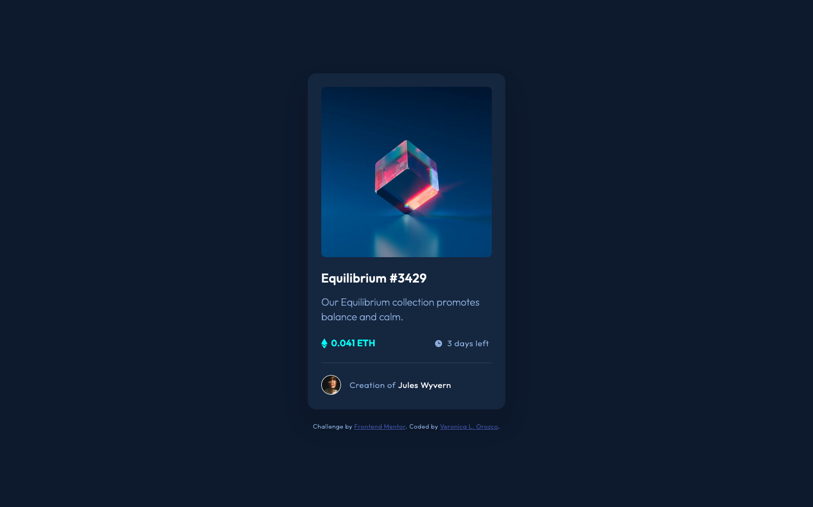

# Frontend Mentor - NFT preview card component solution

This is a solution to the [NFT preview card component challenge on Frontend Mentor](https://www.frontendmentor.io/challenges/nft-preview-card-component-SbdUL_w0U). Frontend Mentor challenges help you improve your coding skills by building realistic projects. 

## Table of contents

- [Frontend Mentor - NFT preview card component solution](#frontend-mentor---nft-preview-card-component-solution)
  - [Table of contents](#table-of-contents)
  - [Overview](#overview)
    - [The challenge](#the-challenge)
    - [Screenshot](#screenshot)
      - [Mobile View](#mobile-view)
      - [Desktop View](#desktop-view)
  - [Links](#links)
  - [My process](#my-process)
    - [Built with](#built-with)
    - [What I learned](#what-i-learned)
    - [Useful resources](#useful-resources)
  - [Author](#author)

---
## Overview

### The challenge

Users should be able to:

- View the optimal layout depending on their device's screen size
- See hover & active states for interactive elements

---
### Screenshot

#### Mobile View


#### Desktop View


---

## Links

- Solution URL: [Add solution URL here](https://your-solution-url.com)
- Live Site URL: [Add live site URL here](https://your-live-site-url.com)

---
## My process

### Built with

- HTML5
- CSS custom properties
- CSS Flexbox
- Mobile-first workflow


### What I learned
*The first challenge I encountered was accurately positioning the elements of .image & .view-img / .eye as an overlay.*

**my index.html solution in preparation to apply styles.css:**
```
<!-- IMAGE -->
  <div class="image">
    
    
    <div class="hide show">
      <div class="view-img"></div>
      
    </div>
  </div>
```

**my styles.css solution for positioning the elements layered:**
```
.equilibrium {
    display: relative;
  }
  .hide {
    display: block;
    position: relative;
    top: -114%;
  }
  .view-img {
    position: absolute;
    top: -114%;
    width: 100%;
    height: 100%;
    background-color: hsla(178, 100%, 50%, 1);
    opacity: 0.5;
    border-radius: 8px;
  }
    .eye {
      position: absolute;
      opacity: 1;
      margin: 127px;
      z-index: 99;
    }
```

*Lastly, it was challenging to hide and show the .img-view & .eye elements for their corresponding hover || active states.*

**my styles.css solution to hide/show an image in the hover/active states:**
```
/* ACTIVE STATE */
.equilibrium:hover {
  cursor: pointer;
}
.equilibrium:active + .show {
  cursor: pointer;
  visibility: visible;
}
```

---

### Useful resources

- [W3schools - css display property](https://www.w3schools.com/cssref/pr_class_display.asp) - Just a friendly reminder for css display properties. This helped me in discovering the solution to overlay the image elements.
  
- [W3schools - display element hover](https://www.w3schools.com/howto/howto_css_display_element_hover.asp) - This helped me in creating a solution to hide/show the image elements. I really liked this pattern as it helped me with my solution and introduced me to the (+) adjacent sibling selector which will come in handy in future code.

---

## Author

- Github - [Veronica L. Orozco](https://github.com/VLOrozco)
- Frontend Mentor - [@VLOrozco](https://www.frontendmentor.io/profile/VLOrozco)
- Codecademy - [orozcov3](https://www.codecademy.com/profiles/orozcoV3)